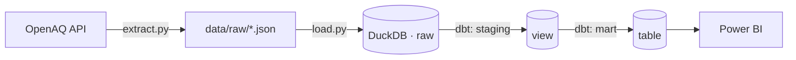

# Pipeline de Qualidade do Ar

Pipeline ELT que extrai dados públicos de qualidade do ar da
[OpenAQ](https://openaq.org) para cidades brasileiras, carrega em um
warehouse analítico (DuckDB) e transforma em um modelo dimensional com
[dbt](https://www.getdbt.com/), pronto para consumo em BI.

Projeto 01 de uma série de 6 documentando minha transição de Analista
de Dados para Engenharia/Arquitetura de Dados — veja o [perfil
completo](https://github.com/amanda-martins-data).

## Arquitetura



Decisões de arquitetura e trade-offs documentados em
[`docs/architecture.md`](docs/architecture.md).

## Stack

`Python` · `DuckDB` · `dbt` · `pandas` · `OpenAQ API`

## Estrutura

```
.
├── src/
│   ├── extract.py              # extração real da API OpenAQ (requer API key)
│   ├── generate_sample_data.py # fixture sintético (sem API key / sem internet)
│   └── load.py                 # carga do bruto -> DuckDB
├── dbt_project/
│   ├── models/staging/         # limpeza, tipagem, deduplicação
│   └── models/marts/           # agregação diária pronta para BI
├── docs/architecture.md        # decisões e trade-offs
└── data/                       # gerado em runtime (não versionado)
```

## Como rodar

```bash
pip install -r requirements.txt

# opção A — dados reais (requer key gratuita: https://explore.openaq.org/register)
export OPENAQ_API_KEY="sua_chave"
python src/extract.py --cidades "São Paulo,Rio de Janeiro,Belo Horizonte"

# opção B — dados sintéticos, sem dependências externas
python src/generate_sample_data.py

# carga + transformação (funciona com qualquer uma das opções acima)
python src/load.py

cp dbt_project/profiles.yml.example ~/.dbt/profiles.yml
cd dbt_project && dbt build
```

`dbt build` roda os 2 modelos e os 9 testes de dados (`not_null`,
`accepted_values`) do projeto.

## Resultado

A tabela final `air_quality_daily` fica disponível no arquivo
`data/warehouse.duckdb`, uma linha por cidade + poluente + dia:

| city           | parameter | unit  | measured_date | reading_count | avg_value | min_value | max_value |
|----------------|-----------|-------|----------------|---------------:|----------:|----------:|----------:|
| Belo Horizonte | pm25      | µg/m³ | 2026-09-04     | 4              | 35.49     | 17.51     | 58.71     |
| Rio de Janeiro | o3        | ppb   | 2026-09-04     | 4              | 43.94     | 25.38     | 57.16     |

Pronta para conectar diretamente no Power BI (conector nativo DuckDB
ou exportando o mart como Parquet/CSV).

## Próximos passos do portfólio

- **Projeto 02** — orquestrar este mesmo pipeline com Airflow.
- - **Projeto 03** — evoluir para arquitetura Medallion (bronze/silver/gold).
  - - **Projeto 06** — adicionar testes de qualidade mais robustos (Great Expectations).
    - 
