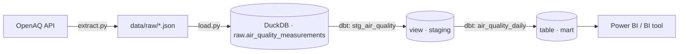

# Arquitetura — Pipeline de Qualidade do Ar

## Visão geral

## Decisões e trade-offs

### 1. ELT em vez de ETL
A transformação acontece **depois** da carga (dbt, em SQL, dentro do
warehouse), não antes em Python. Isso mantém o dado bruto sempre
disponível para reprocessamento — se uma regra de negócio mudar, não é
preciso re-extrair da API, só rodar `dbt run` de novo.

### 2. DuckDB como warehouse local
Escolhido para este projeto por ser um banco analítico embarcado (um
único arquivo `.duckdb`, zero infraestrutura para rodar ou revisar o
projeto). A camada dbt é a peça portável: trocar para Postgres,
BigQuery ou Snowflake é uma troca de `profiles.yml`, os modelos SQL
não mudam.

### 3. Staging separado do Mart
- `stg_air_quality` (view): limpeza, tipagem e deduplicação — sempre
  materializado como view porque é barato de recalcular e não deve
  acumular histórico próprio.
- `air_quality_daily` (table): agregação pronta para consumo,
  materializada como tabela por ser a camada que o BI vai consultar
  repetidamente.

### 4. Deduplicação por `location_id + parameter + measured_at_utc`
A API pode retornar a mesma medição mais de uma vez em execuções
sobrepostas (janela de `--dias` com overlap). A deduplicação usa
`row_number()` priorizando o registro mais recente extraído
(`extracted_at desc`), então uma re-extração sempre "vence" sobre uma
mais antiga para o mesmo timestamp de medição.

### 5. Fixture sintético (`generate_sample_data.py`)
A API da OpenAQ exige uma key gratuita, e nem todo ambiente de
avaliação/CI vai ter acesso à internet ou uma key configurada. O
gerador de dados sintéticos replica exatamente o schema esperado pelo
`load.py`, permitindo rodar e testar o pipeline completo (`load.py` +
`dbt build`) sem dependências externas. Não substitui a extração real
— é um fixture de desenvolvimento.

### 6. Testes de dados no dbt, não no Python
Validações de qualidade (`not_null`, `accepted_values`) vivem como
testes dbt declarativos em `schema.yml`, não como `assert` espalhados
no código Python. Isso os torna auto-documentados e fáceis de estender
— ponto de partida direto para o projeto 06 do portfólio
(observabilidade e qualidade de dados com Great Expectations).

## Limitações conhecidas / próximos passos
- Sem orquestração ainda — rodar `extract.py` → `load.py` → `dbt build`
  é manual. É exatamente o gap que o **projeto 02** (Airflow) resolve,
  reaproveitando este mesmo pipeline.
- Sem particionamento em camadas bronze/silver/gold explícitas — isso é
  o escopo do **projeto 03** (arquitetura Medallion).
- Coordenadas geográficas (`latitude`/`longitude`) chegam nulas no
  fixture sintético; na extração real elas vêm preenchidas pela API e
  podem alimentar uma visualização em mapa no BI.
